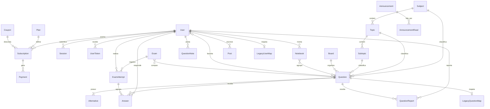

# Modelo de dados

Fonte da verdade: [`prisma/schema.prisma`](../prisma/schema.prisma). Este
documento explica o desenho e registra as decisões de modelagem.

## Visão geral

## Decisões de modelagem

### Alternativas em tabela própria

`Question` guarda o gabarito em `answerKey` (enum `Letter`) e as alternativas
ficam em `Alternative`, com `@@unique([questionId, letter])`. Não há campo
`isCorrect` na alternativa: **o gabarito tem uma única fonte de verdade**, o que
elimina a classe de bug em que alternativa e gabarito divergem depois de uma
edição no admin.

Alternativas em tabela separada (em vez de cinco colunas em `Question`)
permitem texto rico por alternativa e questões com menos de cinco opções, que
aparecem em provas antigas.

### `Question.code`

Identificador interno é `cuid()`, mas o aluno e o professor conversam por
número ("a questão 3412 está com o gabarito errado"). `code` é um inteiro
sequencial (`autoincrement`) exibido na interface e usado nas URLs públicas.
Na migração, ele recebe o número que a questão já tinha no sistema legado
quando este for numérico — evita que o acervo mude de nomenclatura para os
alunos.

### Taxonomia em três níveis

`Subject` → `Topic` → `Subtopic`, com `sortOrder` e `active` em cada nível.
`Question.topicId` e `Question.subtopicId` são opcionais porque parte do
acervo legado está classificada apenas por matéria; a normalização acontece
gradualmente pelo admin, sem bloquear a migração.

`Board` (banca) é entidade própria em vez de texto livre — a inconsistência de
grafia ("FGV", "F.G.V.", "Fundação Getúlio Vargas") é justamente um dos
problemas do acervo atual.

### Estatísticas calculadas, não denormalizadas

Percentual de acerto por matéria, evolução temporal e comparação com a média do
simulado são calculados por agregação sobre `Answer`. Com ~1.000 alunos e
~5.000 questões, o volume comporta agregação direta com os índices existentes
(`[userId, questionId]`, `[userId, createdAt]`, `[questionId]`). Contadores
denormalizados só entram se houver medição mostrando necessidade — a
complexidade de mantê-los consistentes não se justifica nesta escala.

`Answer` guarda **todas** as respostas, sem sobrescrever: a mesma questão pode
ser respondida várias vezes, e o histórico é a base da evolução temporal. As
consultas de "já respondidas" usam a resposta mais recente.

### Simulados

`ExamAttempt` referencia as respostas por `Answer.examAttemptId`, de modo que
uma resposta dada em simulado também conta para as estatísticas gerais do
aluno. `correctCount`/`totalCount` são gravados no encerramento da tentativa —
não é otimização prematura, e sim registro do resultado no momento em que ele
foi apurado, já que o simulado pode ter questões editadas depois.

### Vídeo

`Question.videoId` + `videoProvider` guardam apenas a referência ao serviço
externo. Nenhum arquivo de vídeo trafega ou é armazenado pela aplicação.

### HTML rico

`statement`, `explanation`, `Alternative.text` e `Post.content` guardam HTML
**já sanitizado no momento da escrita** (allowlist de tags e atributos). A
renderização usa a classe `.conteudo-rico` definida em
[`src/app/globals.css`](../src/app/globals.css). Sanitizar na escrita, e não na
leitura, evita pagar o custo em toda requisição e garante que o que está no
banco é seguro.

### Sessões e tokens

`Session.tokenHash` e `UserToken.tokenHash` guardam **apenas o hash** (SHA-256)
do valor que circula no cookie ou no link. Quem obtiver uma cópia do banco não
consegue entrar na conta de ninguém nem usar um link de redefinição. Como esses
valores têm 256 bits de entropia, hash sem sal basta — não há dicionário nem
força bruta viável, diferente do que ocorre com senha.

`UserToken` é um único model para dois propósitos (`PASSWORD_RESET` e
`EMAIL_VERIFICATION`) porque o mecanismo é idêntico: token de uso único, com
prazo, enviado por e-mail. Definir senha atende a três situações — primeiro
acesso após compra na Hotmart, conta migrada com hash incompatível e "esqueci
minha senha" — sem código duplicado.

`LoginAttempt` sustenta o rate limiting. Fica no banco, e não em memória,
porque em ambiente serverless cada requisição pode cair num processo diferente:
um contador em memória não limitaria nada.

### LGPD

`User.deletedAt` faz exclusão lógica: o aluno some da plataforma mas o
histórico agregado permanece íntegro. A exclusão definitiva (rotina de
expurgo), a exportação de dados e o registro do consentimento entram no módulo
de conta do aluno.

### Migração

`LegacyQuestionMap` e `LegacyUserMap` são tabelas permanentes (não temporárias
de script): permitem reexecutar a migração de forma incremental e idempotente,
e responder a qualquer momento "de onde veio este registro". Ver
[`MIGRACAO.md`](MIGRACAO.md).

## Índices

Além das chaves primárias e únicas:

| Tabela            | Índice                    | Consulta que atende                 |
| ----------------- | ------------------------- | ----------------------------------- |
| `questions`       | `(status, subjectId)`     | listagem filtrada por matéria       |
| `questions`       | `(boardId, year)`         | filtro por banca e ano              |
| `answers`         | `(userId, questionId)`    | "já respondi esta questão?"         |
| `answers`         | `(userId, createdAt)`     | evolução temporal do aluno          |
| `subscriptions`   | `(status, endsAt)`        | rotina de expiração de assinaturas  |
| `question_reports`| `(status, createdAt)`     | fila de erros reportados no admin   |
| `payments`        | `(status, paidAt)`        | dashboard de receita (MRR)          |
